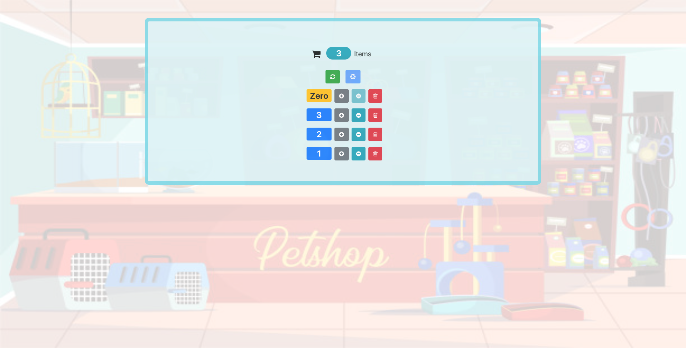

# A simple counter-App using [React.js](https://reactjs.org)

> **This tiny application is like adding,removing,deleting, resetting products which reflects in the total number of products into the shopping cart.**

**This is a very basic app but useful to understand the React Components, states, Data Flow, parent to child etc. .**

## Scripts

Install node modules

#### `npm install`

In the project directory, you can run:

#### `npm start`

Runs the app in the development mode. 
Open [http://localhost:3000](http://localhost:3000) to view it in the browser.
